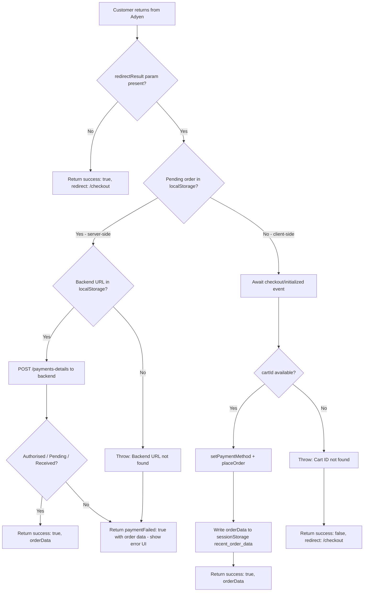

# Adyen Payment Redirection Block

Handles return from Adyen redirect payment flows (3DS, iDEAL, Bancontact, PayPal, etc.) and displays appropriate feedback to users.

## Purpose

This block processes the redirect result from Adyen after a customer completes an external payment flow. It handles two scenarios:

1. **Server-side payments** (e.g., Credit Card + 3DS): Order was placed before redirect. On success, redirects to order confirmation. On failure, displays error message with order details.

2. **Client-side payments** (e.g., PayPal, iDEAL): Order was NOT placed before redirect. On success, places the order and redirects to confirmation. On failure, redirects back to checkout.

## Authoring

This block uses the **key-value configuration pattern**. Authors configure the block via Universal Editor fields - no visible content rows are created.

### Configuration Fields

| Field | Type | Default | Description |
|-------|------|---------|-------------|
| `errorTitle` | Text | "Payment Failed" | Title shown when payment fails for an existing order |
| `errorMessage` | Rich Text | (see below) | Message shown when payment fails. Use `${orderNumber}` to insert the order number |
| `supportLink` | Text | "/support" | URL to the support/contact page |
| `supportLinkText` | Text | "Contact Support" | Text for the support link button |
| `orderDetailsLinkText` | Text | "View Order Details" | Text for the order details link button |

### Default Error Message

```html
<p>Your order <strong>#${orderNumber}</strong> has been created but the payment could not be completed. Please contact our support team within 24 hours to complete your payment, otherwise your order will be cancelled.</p>
```

## Usage

Place this block on a dedicated redirect landing page (e.g., `/adyen-redirect`). The Adyen payment flow will redirect customers to this page with a `redirectResult` query parameter.

### Example Page Setup

```
/adyen-redirect
└── Adyen Payment Redirection (block)
```

## Technical Details

### Files

| File | Purpose |
|------|---------|
| `adyen-payment-redirection.js` | Block decorator - handles config parsing and error display |
| `redirect.js` | Redirect handler logic - processes Adyen redirect result |
| `adyen-payment-redirection.css` | Error message styling |
| `_adyen-payment-redirection.json` | Universal Editor model definition |

### localStorage / sessionStorage Keys

The redirect handler uses these localStorage keys (set during checkout):

- `adyen_payment_result` — Cached payment result (including `cartId` for client-side flows)
- `adyen_pending_order` — Order data for server-side flows (set before redirect, consumed on return)
- `adyen_integration_url` — Backend integration URL (required for server-side flows)

On a successful client-side flow, the completed order data is also written to **`sessionStorage`** under the key `recent_order_data`. This allows the order confirmation page to display order details without an additional API call.

### Flow Diagram



## Accessibility

- Error container uses `role="alert"` and `aria-live="polite"` for screen reader announcements
- Icon is marked `aria-hidden="true"` to avoid redundant announcements
- Buttons have clear, descriptive text

## Testing

The redirection block is covered by two spec files:

**`cypress/src/tests/e2eTests/verifyAdyenRedirectionBlock.spec.js`** (7 suites) — covers the block decorator (`adyen-payment-redirection.js`) init/config path and error UI rendering:

| Suite | What it covers |
|---|---|
| Redirection Block – block present on redirect page | Block element exists in the DOM on the redirect page |
| Redirection Block – spinner/loader appended to document.body during initialization | `.adyen-payment-redirection__loader` appended to `document.body` while redirect is processing (old `.checkout__overlay-spinner-container` inside block no longer used) |
| Redirection Block – paymentFailed=true renders error UI | Error container rendered when redirect handler returns `paymentFailed: true` |
| Redirection Block – error UI shows order number | `${orderNumber}` placeholder replaced with the actual order number |
| Redirection Block – error UI includes support link | Support link rendered with correct href and text |
| Redirection Block – error UI includes order-details link | Order-details link rendered with correct href and text |
| Redirection Block – idles gracefully with no query params | No error and no spinner when no `redirectResult` query param is present |

**`cypress/src/tests/e2eTests/verifyAdyenRedirectBehaviors.spec.js`** (15 suites) — covers the redirect handler logic (`redirect.js`): URL building, `resultCode` handling (`Pending`/`Received` treated as success), `adyen_payment_result` persistence, client-side vs server-side path selection; and the client-side redirect flow (Suites 11–14): `adyen_redirect_payment_code` read and cleared (falls back to `adyen_${type}`), `paymentData` forwarding, `stateData` forwarding, `setPaymentMethod`+`placeOrder` success path; Suite 15a: client-side `placeOrder` failure → redirect to `/checkout` + `adyen_payment_result` cleared; Suite 15b: server-side `Pending` from `payments-details` treated as success + pending order cleared.

## Dependencies

**`adyen-payment-redirection.js`** (block decorator):
- `@dropins/tools/components.js` — ProgressSpinner component
- `../../scripts/aem.js` — `readBlockConfig` utility

**`redirect.js`** (redirect handler logic):
- `@dropins/storefront-order/api.js` — `placeOrder` function
- `@dropins/storefront-checkout/api.js` — `setPaymentMethod` function
- `../../scripts/initializers/index.js` — `getUserTokenCookie`
- `../../scripts/commerce.js` — `rootLink`
- `../../scripts/initializers/checkout.js` — triggers the `checkout/initialized` event which `redirect.js` awaits for client-side flows

